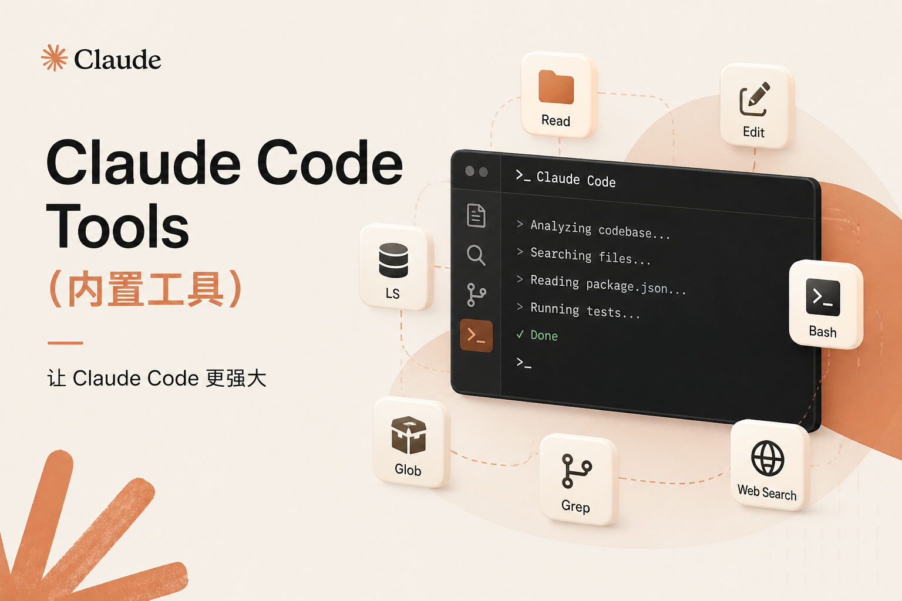

    

Claude Code 作为最流行的几个编码智能体之一，其内置工具是其之所以功能强大的原因。今天探索记录一下 Claude Code 中的内置工具，为后续了解其权限系统奠定基础。官方工具参考在这里: <a href="https://code.claude.com/docs/en/tools-reference">Tools Reference</a>，其中工具按照字母顺序排列，本文在其基础与v2.1.87源码上，基于功能对其进行了划分。

#### 文件/代码操作工具
| 工具 | 描述 | 是否需要权限 |
|---|---|---|
| `Read` | 读取本地文件系统中的文件（文本/图像/PDF/notebook）内容 | ❌ 否 |
| `Edit` | 原地修改文件内容（精确替换文件中字符串） | ✅ 是 |
| `Write` | 创建新文件或完全重写现有文件 | ✅ 是 |
| `NotebookEdit` | 编辑（替换/插入/删除）Jupyter notebook 文件单元格 | ✅ 是 |
| `Glob` | 根据模式匹配快速查找文件路径 | ❌ 否 |
| `Grep` | 搜索文件内容中的模式字符串 | ❌ 否 |
| `LSP`  | 利用语言服务器：跳转到定义、查找引用、报告类型错误和警告 | ❌ 否 |
| `Bash`  | 执行 shell 命令 | ✅ 是 |
| `PowerShell`  | 执行 PowerShell 命令 | ✅ 是 |
| `Config` | 获取或设置 Claude Code 的配置设置（如主题、模型等） | 读取配置自动允许，设置需要检查 |

#### 外部/网络与集成工具
| 工具 | 描述 | 是否需要权限 |
|---|---|---|
| `WebFetch` | 从指定的 URL 获取内容 | ✅ 是 |
| `WebSearch` | 执行网络搜索 | ✅ 是 |
| `mcp` | 管理 MCP 集成 |  |
| `ListMcpResourcesTool` | 列出已连接的 MCP 服务器所暴露的资源 | ❌ 否 |
| `ReadMcpResourceTool` | 通过 URI 读取指定的 MCP 资源 | ❌ 否 |
| `RemoteTrigger` | 提供对 claude.ai CCR (Claude Code Remote) API 的访问，允许用户管理远程代理的触发器 | 只读操作不需要，写操作需要 |

#### 任务与工作流管理

| 工具 | 描述 | 是否需要权限 |
|---|---|---|
| `EnterPlanMode` | 切换到 plan 模式，在编码前设计方案 | ❌ 否 |
| `ExitPlanMode` | 提交计划供用户审批并退出 plan 模式 | ✅ 是 |
| `TaskCreate` | 在任务列表创建新任务 | ❌ 否 |
| `TaskGet` | 获取任务详情 | ❌ 否 |
| `TaskUpdate` | 更新任务状态、依赖关系、详细信息删除任务 | ❌ 否 |
| `TaskList` | 列出所有任务及其当前状态 | ❌ 否 |
| `TaskStop` | 通过 ID 停止运行的后台任务 | ❌ 否 |
| `TaskOutput` | （已弃用）获取后台任务输出 | ❌ 否 |
| `TodoWrite` | 管理会话任务清单（非交互模式和 Agent SDK 中使用），交互式会话使用 `Task*` 工具 | ❌ 否 |
| `CronCreate` | 在当前会话中创建一次性或重复性定时任务 | ❌ 否 |
| `CronDelete` | 按 ID 删除定时任务 | ❌ 否 |
| `CronList` | 列出会话中所有定时任务 | ❌ 否 |

#### Agent/Skill/交互类工具
| 工具 | 描述 | 是否需要权限 |
|---|---|---|
| `Agent` | 生成一个具有独立上下文窗口的 subagent 来处理任务 | ❌ 否 |
| `AskUserQuestion` | 通过选择题向用户提问来收集需求或澄清歧义 | ❌ 否 |
| `SendUserMessage` | 向用户发送消息（支持附加图片/Diff/日志等）内部工具 | ❌ 否 |
| `SendMessage` | 多代理通信工具，允许一个代理向代理团队成员发送消息 | ❌ 否 |
| `Skill` | 在主对话中执行一个 Skill | ✅ 是 |
| `TeamCreate` | 创建一个包含多名队友的代理团队. 仅当`CLAUDE_CODE_EXPERIMENTAL_AGENT_TEAMS=1`时可用 | ❌ 否 |
| `TeamDelete` | 解散代理团队并清理团队成员进程. 仅当`CLAUDE_CODE_EXPERIMENTAL_AGENT_TEAMS=1`时可用 | ❌ 否 |
| `EnterWorktree` | 创建一个独立的 Git 工作树并切换到该工作树。也可以传递一个 path，切换到当前仓库的现有工作树，而不是创建一个新的工作树。此功能不适用于子代理 | ❌ 否 |
| `ExitWorktree` | 退出工作树会话并返回到原始目录。子代理不可用 | ❌ 否 |
| `ToolSearch` | 如果在设置中启用`ENABLE_TOOL_SEARCH`，启用搜索并延迟加载工具 | ❌ 否 |
| `Monitor` | 在后台运行命令，并将每行输出反馈给 Claude，以便它能够对日志条目、文件更改或对话过程中轮询的状态做出反应 | ✅ 是 |

Bash 工具很强大，为什么还要专门制作一些工具呢？
1. 可审计性
> While the Bash tool can do similar things, it's better to use the built-in tools as they provide a better user experience and make it easier to review tool calls and give permission.

2. 特殊功能支持

某些专用工具具有特殊能力，如 `Read` 可以读取图片，PDF，Jupyter Notebooks

3. 模型理解与提示工程

专用工具的描述更准确，减少模型幻觉。

设计哲学 —— Bash 作为"通用后备"，但优先使用专用工具。