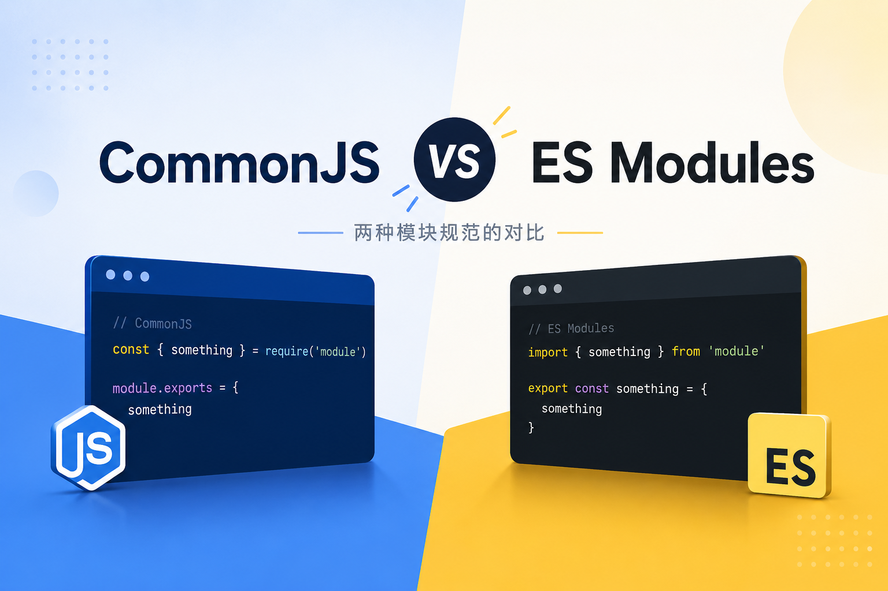

<center>
    
</center>

想写这两个模块的对比很久了，原因是每次看完不久后就记忆重置，想要区分又要搜集一大堆二者的材料，费时费力，这次直接记下来，方便下次复习。

### 历史记忆
在讲两者的区别之前，先聊一聊 JavaScript 的历史。JavaScript 由 Brendan Eich 于 1995 年创建，主要目的是为网页引入新的轻量脚本语言，给网页增加一些交互。在此之前，1989–1991 年，Tim Berners-Lee 发明了万维网技术，但当时并不流行，仅局限于科研小圈子中共享文章。直到两年后的 1993 年，Marc Andreessen 和 Eric Bina 开发了一款易于安装与使用的、带图形界面（可显示图片、点击链接，有窗口界面）的 Web 客户端 [NCSA Mosaic](https://en.wikipedia.org/wiki/NCSA_Mosaic)，让万维网技术普及流行开来。

看到互联网的魔力之后，商业界为之疯狂，认为 Web 将改变整个世界。Jim Clark（Silicon Graphics 创始人）敏锐觉察到 Web 将成为下一代计算平台，于是找来 Marc Andreessen 和 Eric Bina 创办 Netscape，Netscape 从头开发下一代类-Mosaic 的浏览器，迅速取代了 Mosaic。

90 年代同时也是"脚本语言"潮，当时的脚本语言真正的意思是用来粘合已有软件组件的语言。比如微软的 Visual Basic，用来编排 Microsoft Office 应用；苹果的 AppleScript，用于自动化 macOS 上的任务。由于 Berners-Lee 最初发明 Web 时，目标只是为了让科学家共享文档，因此最核心的技术是`URL` + `HTTP` + `HTML`三叉戟。HTML 作为静态的标记语言，被用来描述文档的结构。随着 Netscape 推广 Web，一个主要的问题随之而来，就是 Web 要不要支持脚本语言？该如何支持？

网页脚本的候选语言最初包含 Scheme, Unix-based 语言如 Perl, Python 和 Tcl，以及微软的 Visual Basic。一开始 Brendan Eich 被招进来在浏览器中实现`Scheme`（一种 Lisp 方言），但 Eich 入职后，发现做什么语言已经不单是技术问题，而是商业战争。1994 年底，Netscape 拒绝 Microsoft 较低的收购报价，管理层认为微软之后会发动"全面战争"。微软则认为 Web 可能取代操作系统，成为新的软件平台，于是紧急开发 Internet Explorer，抢占 Web 市场。与此同时，Sun Microsystems 正疯狂宣传 Java，提出那句经典的"Write Once, Run Anywhere"口号，这同样对 Microsoft 产生了巨大的威胁，于是和 Netscape 一拍即合，Java 将嵌入之后的 Netscape 2。
> 微软当时的口号："Embrace, Extend, Extinguish"，意思就是先拥抱开放标准，再加入自己的扩展，最后让别人无法兼容而被"消灭"。

鉴于上述背景，为网页做脚本语言的 Eich 需要考虑商业与市场现实，Scheme 优雅但学术性太强，推广难度大，Visual Basic 是微软路线也不可取，其他语言名声不够大，不符合战略要求。当时 Java 的商业品牌火热，再加上微软已经准备进场，亟需迅速发布一款 Web 脚本语言，建立标准，于是 JavaScript 诞生了，它设计轻量、语法简单、专用用途，和今天的模样是天壤之别。
> 从上面历史可以学到什么呢？
> - Eich 的 Scheme 背景，使得 JavaScript 中携带了很多函数式思想。如：函数作为一等公民，闭包，map，filter，……，GC，动态类型。
> - 为什么大公司都要建立标准？ —— 标准就是话语权。AI 时代，现在很多接口、协议的标准都在疯狂竞争中，像 CLAUDE.md 与 AGENTS.md，open responses 等等。
> - 会不会有新的语言诞生呢？ —— 需要进一步探索当下的需求与问题究竟是什么？是 Agent 间的沟通？还是其他呢？候选名单（zero，Mojo，nano）还在增长中。

### 正文开始

让我们快进到文档主题相关的内容，2009 年，Kevin Dangoor 发布了一篇题为《What Server Side JavaScript needs》，探讨了服务端 JavaScript 缺少完善的生态系统问题，比如需要跨解释器的标准库、需要标准数据库接口、需要一种引入其他模块的标准、需要代码打包与分发机制、需要软件包仓库轻松处理软件包安装与依赖等等。因此 CommonJS 小组诞生了，一年后，CommonJS 构造了一个模块化系统，一个跨解释器标准库，一些标准接口，一个软件包系统以及一个软件包仓库，这些概念最终被 Node.js 引入而成为事实性的标准。直到 2015 年 ES6（ECMAScript 2015）规范发布，正式从语言规范上引入模块系统以及现代化语法。
> 这里不得不提一下 Node.js 的作者 [Ryan Dahl](https://tinyclouds.org/)，也是 deno 的联合创始人。

因此，透过历史脉络来看两者区别就很清晰了，CommonJS 和 ES Modules（ECMAScript Modules, ESM）是 Node.js 的两种模块系统，CommonJS 出现得早，并成为一段时期的事实标准，ES Modules 来得晚，但是真正的语言标准，未来在向 ES Modules 演进。

1. Node.js 如何判断使用哪种模块？ —— 由 `package.json` 中 `type` 字段决定
```json
{
    "type": "module"
}
```
当设置为 `commonjs` 时，Node.js 采用 CommonJS 模块系统；当设置为 `module` 时，Node.js 会把 JavaScript 文件解释为 ES Modules。 如果未设置，Node.js 会检查模块的源代码以查找 ES module 语法，如果找到，则将代码作为 ES module 运行；否则将视为 CommonJS 模块。

2. 语法区别

- `.mjs` 永远是 ESM；`.cjs` 永远是 CommonJS。
- 导入，导出方式
```js
// commonjs
module.exports = { foo }    // 导出

const mod = require('./mod')    // 导入

// -------------------------------------

// esm
export const foo = 1    // 导出

import { foo } from "./mod.js" // 导入
```
- ESM 必须写文件扩展名，即显式写 `.js` 后缀。

本质上，CommonJS 是运行时加载，当 Node 执行到 `require` 时，读取文件，执行代码，返回 `exports`，因此可以动态 `require`。
```js
if (dev) {
    require('./dev')
}
```
而 ESM 在代码运行前就需要确定依赖，提前解析 `import/export`，因此不支持在条件语句中放静态导入，为支持动态导入，ESM 的 `import` 是异步的。
```js
if (dev) {
  await import('./dev.js')
}
```
- 双模块导出 —— 配置 `package.json` 中 `exports` 字段。
```json
{
  "exports": {
    "import": "./dist/index.js",
    "require": "./dist/index.cjs"
  }
}
```

3. 现状：npm 大量历史仍是 CommonJS，因此很多项目内部用 ESM，兼容层用 CommonJS。


### 参考资料
- [JavaScript: The First 20 Years](https://dl.acm.org/doi/10.1145/3386327) — JavaScript 语言创建历程
- [ECMAScript](https://en.wikipedia.org/wiki/ECMAScript) — ECMAScript 维基百科
- [nodejs-v0.0.1](https://github.com/nodejs/node-v0.x-archive/releases/tag/v0.0.1) — Ryan Dahl 初版 Node.js
- [What Server Side JavaScript needs](https://www.blueskyonmars.com/2009/01/29/what-server-side-javascript-needs/) — Kevin Dangoor 发起号召与 CommonJS 诞生
- [CommonJS: the First Year](https://www.blueskyonmars.com/2010/01/29/commonjs-the-first-year/) — Kevin Dangoor 回顾 CommonJS 标准诞生第一年的历程
- [ECMAScript Modules](https://nodejs.org/api/esm.html) — Node.js 官方 ESM 文档
- [CommonJS Modules](https://nodejs.org/api/modules.html) — Node.js 官方 CJS 文档
