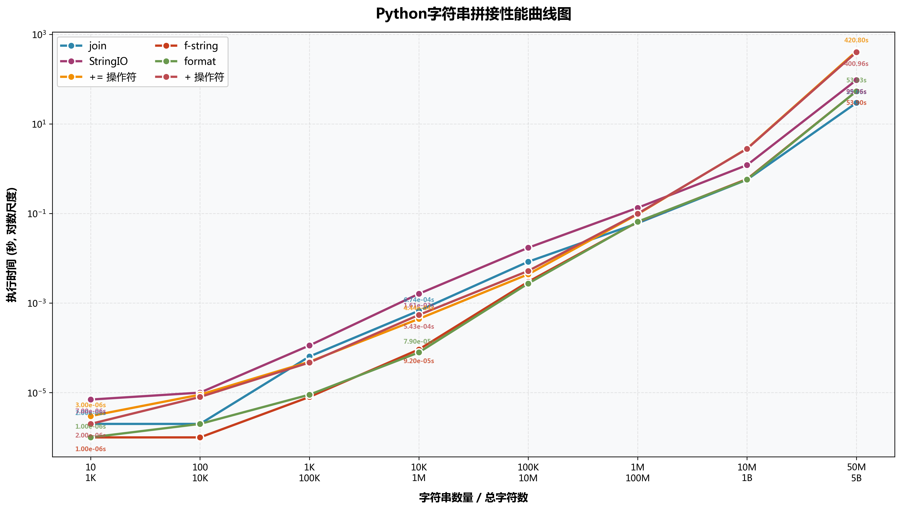
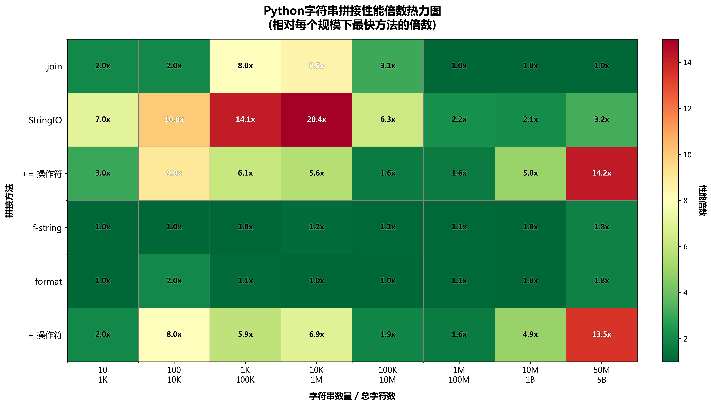
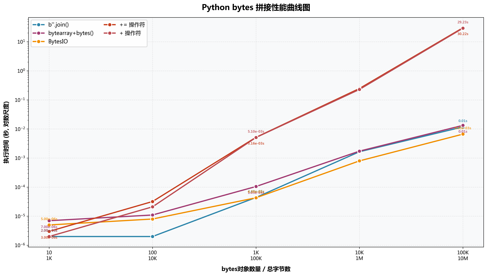
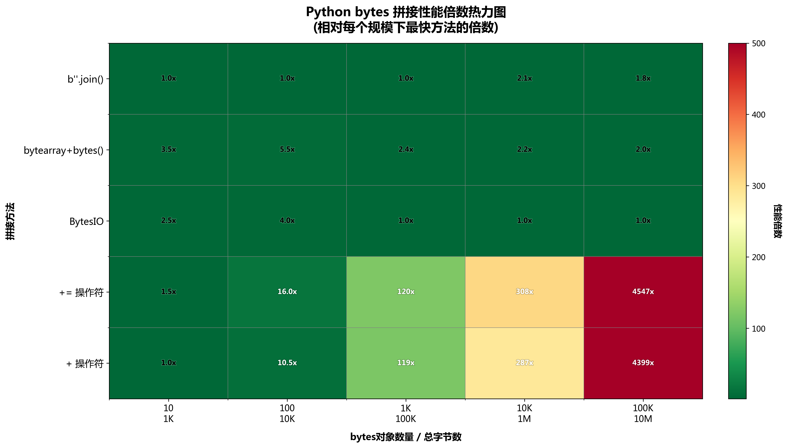
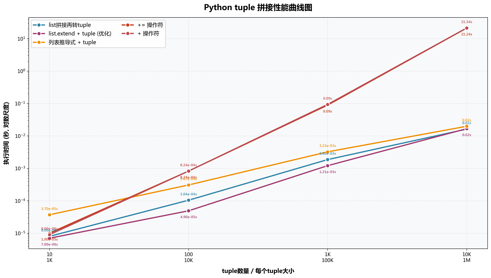
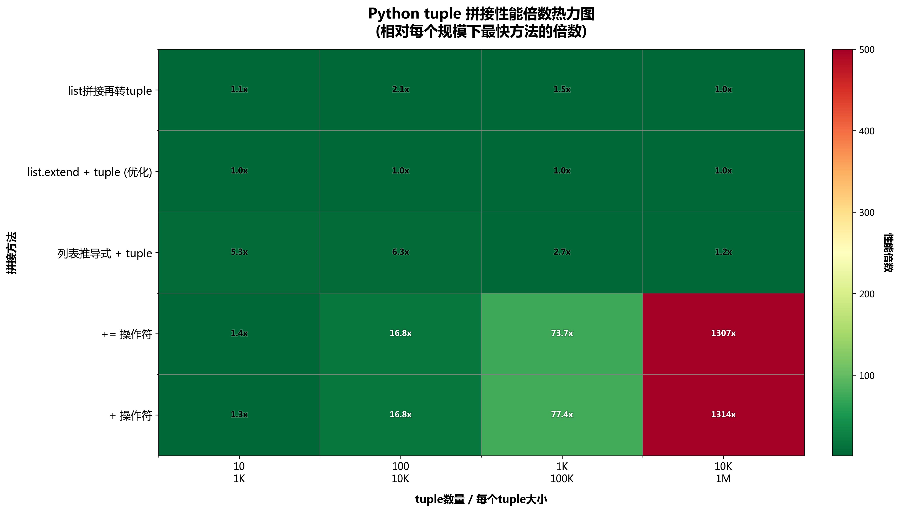

+++
date = '2025-11-27T21:10:47+08:00'
draft = false
title = 'Python Immutable Sequences Concatenation'
tags = ["python"]
math = true
+++
## 引言

连接操作符 `+` 是 Python 提供的用于序列连接的简单方案，相同类型的序列 `s` 和 `t` 通过如下步骤实现序列对象的连接。
```python
s + t
```

这种方式简单直观，但对于不可变序列，会因为需要频繁创建新对象而造成较大开销，因此通常不推荐使用。Python 标准库文档在内置类型小节中提到了不可变序列在连接时需要特别注意的地方。
> Concatenating immutable sequences always results in a new object. This means that building up a sequence by repeated concatenation will have a quadratic runtime cost in the total sequence length. To get a linear runtime cost, you must switch to one of the alternatives below:
> - if concatenating str objects, you can build a list and use str.join() at the end or else write to an io.StringIO instance and retrieve its value when complete.
> - if concatenating bytes objects, you can similarly use bytes.join() or io.BytesIO, or you can do in-place concatenation with a bytearray object. bytearray objects are mutable and have an efficient overallocation mechanism.
> - if concatenating tuple objects, extend a list instead.

这里提到的不可变序列包含 `str`, `bytes` 和 `tuple`。 它们无法像可变序列一样就地更改，每次更改都会产生一个新对象（可通过 `id()` 测试），然后将旧对象的内容拷贝至新对象，从而导致 $$O(n^2)$$ 运行时间（`n` 是序列长度）。

为了实现线性运行开销，推荐 `str` 使用 `str.join()` 方法或 `io.StringIO` 方法； `bytes` 采用 `bytes.join()` 方法或 `io.BytesIO` 方法； `tuple` 采用 "list+extend" 方法。

为了验证上述结论，下面将针对不可变序列常用的拼接方法进行一个测试比较。

## 字符串序列连接方法比较

首先是 `str` 的六种连接方法，将在$$[10, 10^2, 10^3, 10^4, 10^5, 10^6, 10^7, 5\times10^7]$$规模大小的字符串序列上进行连接测试，其中每个字符串大小为 100 。
```python
def method1_plus_operator(strings):
    """方法1: 使用 + 操作符"""
    result = ""
    for s in strings:
        result = result + s
    return result

def method2_plus_equal(strings):
    """方法2: 使用 += 操作符"""
    result = ""
    for s in strings:
        result += s
    return result

def method3_join(strings):
    """方法3: 使用 join 方法"""
    result = "".join(strings)
    return result

def method4_stringio(strings):
    """方法4: 使用 StringIO"""
    sio = StringIO()
    for s in strings:
        sio.write(s)
    result = sio.getvalue()
    return result

def method5_format(strings):
    """方法5: 使用 format 方法"""
    result = "{}".format("".join(strings))
    return result

def method6_fstring(strings):
    """方法6: 使用 f-string"""
    result = f"{''.join(strings)}"
```

测试结果显示：



可以得到如下结论：

1. `f-string` 和 `format` 方法性能表现不错而且稳定。
2. `+/+=` 操作符在大规模字符串（$$\ge10M$$）拼接时表现较差，推荐使用 `str.join()` 方法。
3. `StringIO` 性能不稳定，在所有规模下均非最优选择，应避免使用。

## 字节序列连接方法比较
接下来是 `bytes` 的连接方法，在$$[10, 10^2, 10^3, 10^4, 10^5]$$规模大小的字节序列上进行连接测试，其中每个字节序列大小为 100 字节。
```python
def method1_plus_operator(byte_objs):
    """方法1: 使用 + 操作符"""
    result = b""
    for b in byte_objs:
        result = result + b
    return result

def method2_plus_equal(byte_objs):
    """方法2: 使用 += 操作符"""
    result = b""
    for b in byte_objs:
        result += b
    return result

def method3_join(byte_objs):
    """方法3: 使用 join 方法"""
    result = b"".join(byte_objs)
    return result

def method4_bytesio(byte_objs):
    """方法4: 使用 BytesIO"""
    bio = BytesIO()
    for b in byte_objs:
        bio.write(b)
    result = bio.getvalue()
    return result

def method5_bytearray_join(byte_objs):
    """方法5: 使用 bytearray 拼接"""
    ba = bytearray()
    for b in byte_objs:
        ba.extend(b)
    result = bytes(ba)
    return result
```

测试结果显示：



可得到结论：
1. `b"".join()` 方法性能优异且稳定，`BytesIO` 在大规模情况下（$$\ge1M$$）性能最优。
2. `+/+=` 操作符在大规模时性能崩溃。

## 元组序列连接方法比较
最后是 `tuple` 的拼接方法，在$$[10, 10^2, 10^3, 10^4]$$规模大小的元组序列上进行连接测试，每个元组大小为 100。
```python
def method1_plus_operator(tuples):
    """方法1: 使用 + 操作符"""
    result = ()
    for t in tuples:
        result = result + t
    return result

def method2_plus_equal(tuples):
    """方法2: 使用 += 操作符"""
    result = ()
    for t in tuples:
        result += t
    return result


def method3_list_to_tuple(tuples):
    """方法3: 先转list拼接再转回tuple"""
    result_list = []
    for t in tuples:
        result_list.extend(t)
    result = tuple(result_list)
    return result

def method4_unpacking(tuples):
    """方法4: 使用解包操作 (*args)"""
    # 注意: 只适合元组数量不太多的情况
    result = tuple(item for t in tuples for item in t)
    return result

def method5_list_extend_tuple(tuples):
    """方法5: list.extend + tuple (优化版)"""
    if not tuples:
        return ()
    result_list = list(tuples[0])
    for t in tuples[1:]:
        result_list.extend(t)
    return tuple(result_list)
```
测试结果显示：


由图可知：`list.extend`及其变异版本是 `tuple` 拼接的最佳选择。