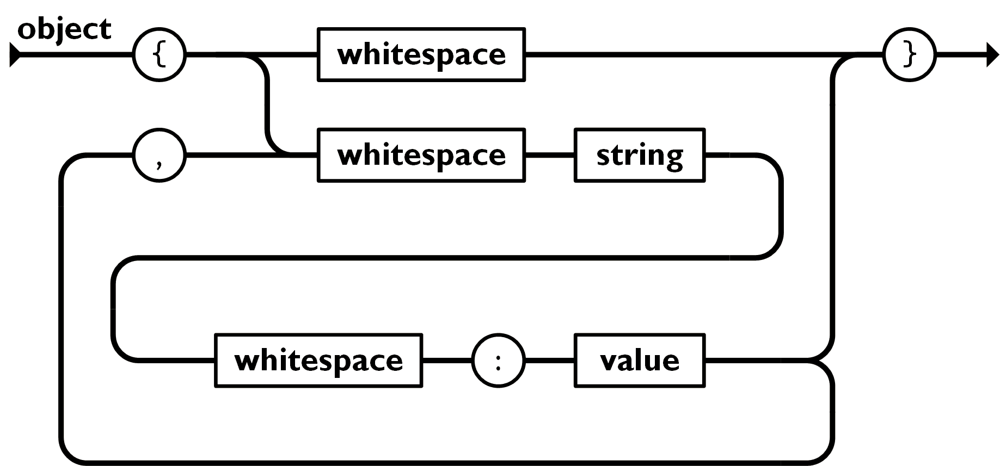
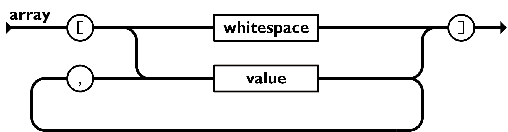

+++
date = '2025-11-21T21:27:20+08:00'
draft = false
tags = ["json", "python"]
title = 'JSON 详解'
+++

不管是网络负载传输，还是结构化对象修改，都与 JSON 息息相关。鉴于最近一直在与 JSON 打交道，自己对 JSON 的理解也逐渐深入，这里做一下记录，便于日后再遇到时还能保持“熟悉”。

## JSON 定义
> JSON (JavaScript Object Notation)
是一种开放标准的文件格式和数据交换格式，使用文本进行存储和传输由 **name-value
pairs** 和数组（或其他可序列化的值）组成的对象。—— Wikipedia JSON

JSON 的全称暗示了其与 JavaScript 相关，但是考虑到 JavaScript 自身的命名原因（Java is famous[^1]），一定程度上降低了这种相关性。事实上也确实如此，JSON 源于 JavaScript 但却是语言无关的，并不依赖于 JavaScript 的语言特性。

维基百科中提到 JSON 是一种文件格式（文件格式规定了信息被编码存储在计算机文件中的方式。类似于`.jpg`,`.pdf`对应的 JPG 和 PDF 分别使用二进制来表示图片和文档对象，或者`.txt`对应的 TXT 使用字符文本来存储无结构数据。）不同的是，JSON 对应的 `.json` 使用字符文本来**存储**结构化数据。

此外，JSON 是一种数据交换格式，可以用于进程 A 与进程 B 的数据**交换**。

[^1]: [Wikipedia JavaScript History](https://en.wikipedia.org/wiki/JavaScript#History:~:text=The%20choice%20of%20the%20JavaScript%20name%20has%20caused%20confusion%2C%20implying%20that%20it%20is%20directly%20related%20to%20Java.%20At%20the%20time%2C%20the%20dot%2Dcom%20boom%20had%20begun%20and%20Java%20was%20a%20popular%20new%20language%2C%20so%20Eich%20considered%20the%20JavaScript%20name%20a%20marketing%20ploy%20by%20Netscape.)


## JSON 结构

JSON 可由两种结构组成:
- **name-value** 对集合（或称为 _object_ ）。实际上是限制键（key）为字符串的键值对，不同语言对这种键值对集合的叫法不同，如 JavaScript: object, 数据库: record，C/C++/Go: struct, Python: dict 等。
<center>
    
</center>

上图源于 ECMA-404 [The JSON Data Interchange Standard](https://www.json.org/json-en.html)，可以这样看。上路径: `{ }`是一个空对象；下路径: `{ string : value, ..., string : value }` 是可重复n次的 `string : value` 对。
其中 `value` 可以是字符串，数字，`true/false/null`，对象或数组，这些结构可以嵌套。

- 有序值列表。在大多数语言中，通常以数组、向量、列表或序列的形式实现。
<center>
    
</center>

上路径: `[ ]` 是空列表；下路径: `[value,...,value]`，其中 `value` 同上。

### JSON 进行数据存储和交换的好处？
- JSON 使用文本存储，方便阅读与书写。
- JSON 非常流行，各种语言都有相应的 JSON 处理库可简化复杂数据的序列化和反序列化过程。这里引用 Python 标准库中对 json 模块的介绍做一下解释：字符串可以很容易地写入文件或从文件中读取，因为在文本模式下，可以直接使用 `write` 向文件对象写入字符串以及 `read` 方法读取返回字符串。不过数字类型就略微复杂些，写入前需要使用 `str()` 转换为字符串（序列化过程），读取后使用 `int()` 转换为数字类型（反序列化过程）。事实上，数字类型的序列化和反序列化还是较为简单地，仅使用内置函数就可以搞定。但如果想要存储和传输更复杂的数据（如嵌套列表、字典等）时，手动的序列化和反序列化就变得困难了。JSON 库提供了类似于 `str/int` 的方法，用于直接将复杂对象转换为字符串，或从字符串中解析到对象。

## JSON 操作(Python)
Python 中的 `json` 模块提供了序列化和反序列化 python 对象的方法。下面使用 `dir()` 展示了该模块的公开 API。
```python
>>> import json
>>> dir(json)
['JSONDecodeError', 'JSONDecoder', 'JSONEncoder', 'detect_encoding', 'dump', 'dumps', 'load', 'loads']
```

- `dump`, `dumps`, `load`, `loads` 是 python 提供的类似上述 `str/int` 方法，用于将复杂对象转换为字符串或写入文本文件，或从字符串或文本文件中读取对象。`detect_encoding` 通过检查 JSON 字节流的前几个字节返回 JSON 字节数据的编码格式（如, `utf-8/utf-8-sig`等），在 `load` 内部调用实现自动编码检测。

```python
dump(
    obj,
    fp,
    *,
    skipkeys=False,
    ensure_ascii=True,
    check_circular=True,
    allow_nan=True,
    cls=None,
    indent=None,
    separators=None,
    default=None,
    sort_keys=False,
    **kw
)

dumps(
    obj,
    *,
    skipkeys=False,
    ensure_ascii=True,
    check_circular=True,
    allow_nan=True,
    cls=None,
    indent=None,
    separators=None,
    default=None,
    sort_keys=False,
    **kw
)
"""
    dump 函数用于将复杂 python 对象写入文件对象 fp . 
    dump 函数用于将复杂 python 对象写入 python 字符串对象.
"""
```
参数 `ensure_ascii` 用于控制序列化时对非 ASCII 字符的处理。当 `ensure_ascii=True` （默认）时，输出将转义所有非 ASCII 字符和不可打印字符；当 `ensure_ascii=False`（推荐）时，将保留原始字符。
参数 `indent` 用于指定缩进，默认为 `None`，如果希望可读，可设置 `indent=4`.

```python
load(
    fp,
    *,
    cls=None,
    object_hook=None,
    parse_float=None,
    parse_int=None,
    parse_constant=None,
    object_pairs_hook=None,
    **kw   
)

loads(
    s,
    *,
    cls=None,
    object_hook=None,
    parse_float=None,
    parse_int=None,
    parse_constant=None,
    object_pairs_hook=None,
    **kw
)
"""
    load 函数用于从文件对象 fp 读取复杂对象.
    loads 函数用于从字符串对象读取复杂对象.
"""
```

- `JSONEncoder` 类，`JSONDecoder` 类可用于自定义 python 对象到 JSON 对象的编码器和解码器。

下表概述了 Python 对象与 JSON 对象的对应关系：
| Python | JSON |
|---|---|
| dict | object |
| list | array |
| str | string |
| int | number(int) |
| float | number(real) |
| True | true |
| False | false |
| None | null |

（除了上述对象，python json 模块还支持 JSON 规范不支持的 NaN, Infinity, 和 -Infinity 特殊浮点数值，该功能可通过 `dump` 和 `dumps` 的 `allow_nan` 参数控制）

```python
>>> import json
>>> json_str = '{"a": NaN, "b": Infinity, "c": -Infinity}'
>>> data = json.loads(json_str)
>>> print(data)
{'a': nan, 'b': inf, 'c': -inf}
```

## 扩展与思考
JSON 非常轻量，没有过多的冗余元素（如注释），一定程度上体现了其作为数据交换格式的精简性，不过这也导致了我们在拿到一个复杂的 JSON 文件时可能难以入手理解。MAML（Minimal. Human-readable. Machine-parsable.）是一个较新的配置语言，倒是可以与 JSON 搭配使用，作为 JSON 对象的“参考手册”。

- [Introducing JSON](https://www.json.org/json-en.html)
- [MAML](https://maml.dev/): [提供了注释、多行 raw
strings、可选逗号等功能](https://maml.dev/#:~:text=MAML%20keeps%20JSON%E2%80%99s,key%2Dvalue%20objects)，支持作为配置语言。（当处理大型结构化数据时，注释对于理解对象组成非常有帮助）

