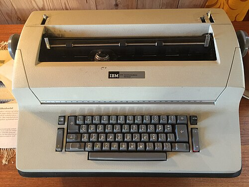
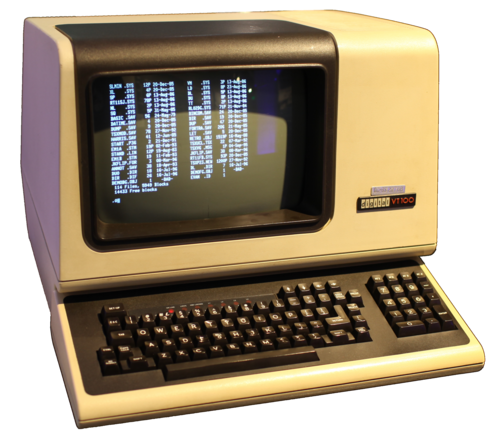

### 引言

谈到终端，首先想到的可能是 Matrix、黑客，或者一个 Linux 极客：手指在键盘上起伏，前方的屏幕上闪烁着各种字符。（尽管 PowerShell 搭配上自定义配置已经很不错，但总觉得缺了那么一点味道。）

今天，就来解析一下这一令新手恐惧、令老手痴狂的艺术品。终端（Terminal）在计算机早期（上世纪 60 年代）属于硬件设备，用于向计算机输入数据或从计算机读取数据。最早的终端是电传打字机（Teletype），如下所示的 IBM 2741 便是一款于 1965 年推出的带键盘的打印计算机终端：用户打字，计算机接收输入；计算机响应，打印纸输出结果。

<center>
    
</center>

同期，视频显示单元（Video Display Unit, VDU）快速发展，用于将信息显示在屏幕而非打印纸上。70 年代后，视频终端逐步取代打印终端，标志性产品是 DEC VT100，它定义了现代终端模拟器仍然遵循的 ANSI 转义码。

<center>
    
</center>

### 终端软件栈
如今我们所说的终端已不再指代上述硬件设备，更多是指一个终端窗口——它实际上是一个终端仿真器（Terminal Emulator）。终端仿真器是一个应用程序，用于模拟上述物理终端，除了处理输入/输出，还负责在屏幕上渲染字符、连接 Shell 等任务。因此，我们如今提到的终端，实际上是一个由多个组件构建的软件栈。

<pre class="ascii-diagram">
┌──────────────────────────────────┐
│  Terminal Emulator               │  GUI 程序，渲染文字、捕获按键
│(Kitty, Alacritty, GNOME Terminal)│
└──────────────────────────────────┘
                | PTY Master fd
                | 读/写字节
┌──────────────────────────────────┐
│  Kernel PTY + Line Discipline    │  内核层：回显、信号、行编辑
└──────────────────────────────────┘
                | PTY Slave fd
                | (/dev/pts/N)
┌──────────────────────────────────┐
│  Shell / Application             │  bash, zsh, vim, htop
│ (reads stdin, writes stdout)     │  发送转义序列以渲染界面
└──────────────────────────────────┘
</pre>

用户按键盘 -> 终端模拟器收到按键 -> 写入 PTY Master -> Line Discipline 处理 -> Shell 从 PTY Slave 读到字符 -> Shell 响应输出 -> Line Discipline 处理 -> PTY Master -> 终端模拟器渲染到屏幕上。

在讲述各组件前，先介绍一下终端窗口。终端窗口是一个由大小相同的单元格组成的网格，类似图片的像素。每个单元格包含一个字符以及样式信息（颜色、粗体、下划线）。更多细节可见下方链接：How Terminals Work.

<center>
    
</center>

- 终端仿真器：
  1. 调用 `posix_openpt()` 或 `openpty()` 创建 PTY 对。
  2. 派生 Shell 子进程。
  3. 将 PTY slave 设置为 Shell 子进程的 stdin、stdout 和 stderr。
  4. 从 PTY master 读取 Shell 的输出。
  5. 向 PTY master 写入，以发送用户的按键操作。

终端仿真器维护一个回滚缓冲区（Scrollback buffer）: 用于存储终端上的历史输出。终端窗口只显示有限的行数，超出屏幕的旧输出将进入 scrollback buffer. 不同终端模拟器维护的默认回滚缓冲区大小可能不同，超出限制的旧内容将会被丢弃。日常使用 `clear` 或 ctrl-l 命令实际上只清屏幕，不清 scrollback, ANSI 序列 `\e[3J` 会真正清空 scrollback.

- 伪终端（Pseudo-terminal, PTY）：由内核创建的一对虚拟设备。
    - PTY master：终端模拟器端，向其中写入用户输入的内容，读取应用程序写入的内容。
    - PTY slave：应用程序端。对于应用程序而言，PTY slave 就像真正的串行终端。

- Kernel TTY Line Discipline：PTY master 与 PTY slave 之间存在 Line Discipline（线路规则），实质是一个用于处理输入和输出的内核级转换器。
    - 输入处理（终端 → 应用程序）：
    ```
    Echo（回显）：当输入字符时，线路规则立即把字符写回终端，但此时应用尚未参与。
    行编辑：在规范模式（Canonical mode）下，线路规则处理退格键（Backspace）、删整行（Ctrl+U）、删词（Ctrl+W）。
    信号生成：Ctrl+C → SIGINT，Ctrl+Z → SIGTSTP，Ctrl+\ → SIGQUIT
    行缓冲：规范模式下，缓冲单行输入的内容，只有在按下 Enter 键后才会传递给应用程序。
    ```
    - 输出处理（应用程序 → 终端）：
    ```
    换行符转换：LF (0x0A) 转换为 CR + LF，使光标返回到第 1 列。
    Tab 扩展：（可选）将制表符转换为空格。
    流控制：Ctrl+S 暂停输出，Ctrl+Q 恢复。
    ```
`stty` 命令通过配置内核的 TTY 线路规则，来控制如何处理终端和应用程序之间传输的字节。

### 规范模式 vs 原始模式

{}
| | Canonical (Cooked) 模式 | Raw (Non-Canonical) 模式 |
|---|---|---|
| 输入 | 按行缓冲，Enter 才发送 | 每个字符立即发送 |
| 回显 | 自动回显按键 | 不回显（应用自行处理）|
| 行编辑 | 退格、Ctrl+U 等由内核处理 | 应用自己处理输入 |
| 信号 | Ctrl+C → SIGINT | Ctrl+C 只是字节 0x03 |
| 示例 | `bash`, `cat`, `ls` | `vim`, `htop`, `less` |
{}


Canonical 模式下，你看到的输入回显不是应用打印的，而是 Line Discipline 自动完成的；在 Raw 模式下，应用程序必须自己做回显。


下面是一个**可交互的虚拟终端**（基于 xterm.js，在前端用 JS 真实模拟了一个 Line Discipline）。点击切换 Canonical / Raw，亲手敲击键盘，感受两种模式的差异：


 
### 参考文章


