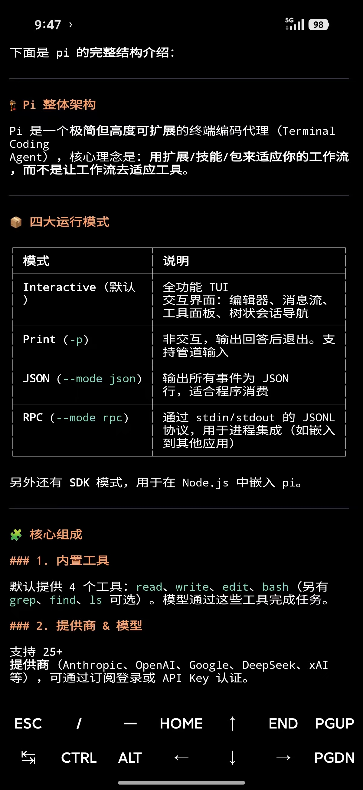
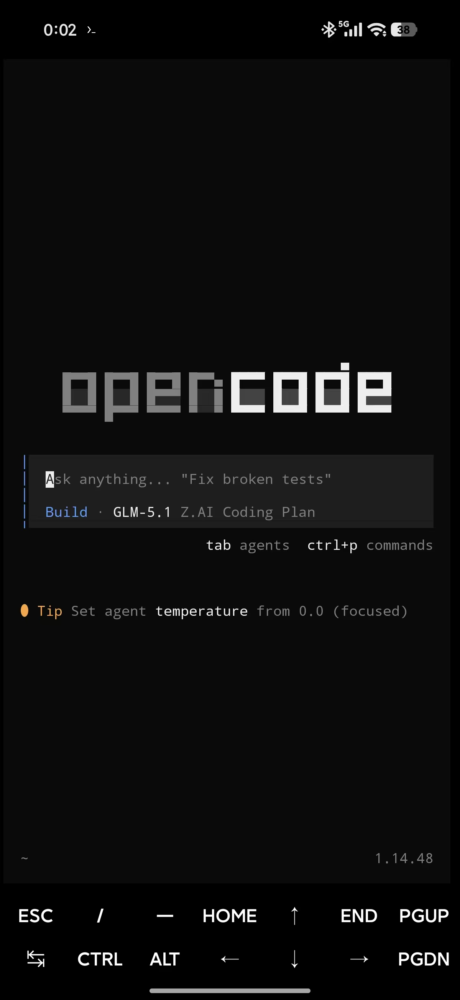

这几天在学习 [Pi](https://pi.dev/)，一个极简、可自定义的开源编码智能体。发现其竟然可以通过联合 [Termux](https://termux.dev/en/) 在 Android 端运行，觉得很有意思便尝试了一下，发现竟打开了新世界。下面是几张示意图：

    

使用感觉很好，完全符合人类友好型计算机设备从台式计算机向便携式手机演化的趋势，它不像传统的问答式辅助工具，而是智能体直接操控移动设备，可读写文件、查询网页、多步执行、Bash 操作等等，功能远远强于现有问答式对话工具，比一堆收费的 Claw 更好的点在于：更强的自主性，唯一需要配置的是模型 API，目前很多大模型均已被 Pi 支持，感谢 Mario Zechner（Pi 的创始者）。

在运行起 Pi 之后，我又尝试运行 opencode 工具，虽然遇到了一些问题，但都通过询问 Pi 解决了，解决方案在这里[opencode-termux](https://github.com/Youpen-y/opencode-termux)

    

结论：即使是在端侧应用大模型，也应该紧紧围绕前沿模型，而不是一味思考在端侧本地部署小型模型，小型模型只适合解决专用、特定问题.

