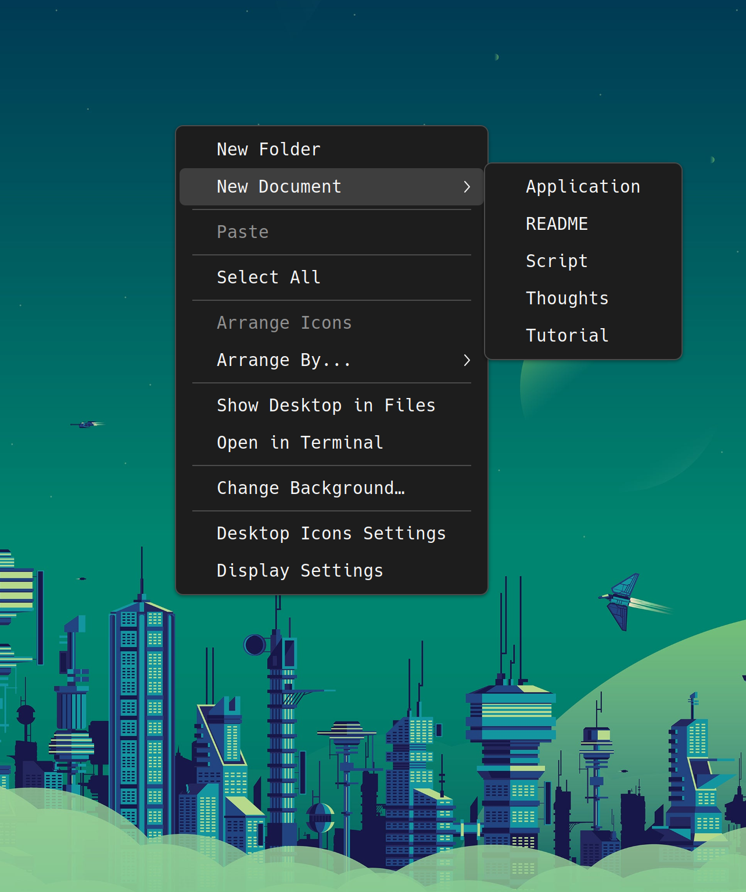

很多人安装了 Ubuntu 后都会发现默认存在一个 `Templates` 目录，但是大都没有或不知道该如何利用它。今天就来分享一下 `Templates` 目录是什么以及如何用它提升我们日常写作或工作的效率？

## 从 User Dirs 规范到 Templates
`Tempaltes`，`Desktop`，`Download`，`Public`，`Documents`，`Music`, `Pictures`，`Videos` 目录是 Ubuntu （以及大多数 Linux 桌面环境）默认提供的用户目录（XDG User Directories）。

XDG（X Desktop Group 的缩写，后改名为 [freedesktop.org](https://www.freedesktop.org/wiki/)），致力于开发与维护与桌面系统相关的规范和软件。其中 XDG 基础目录规范([XDG Base Directory Specification](https://specifications.freedesktop.org/basedir/latest/)) 定义了一个或多个基目录及其存放位置。如：
```bash
$XDG_CONFIG_HOME    (~/.config)
$XDG_DATA_HOME      (~/.local/share)
$XDG_CACHE_HOME     (~/.cache)
```
而 XDG 用户目录则定义了如下默认目录变量(`~/.config/user-dirs.dirs`)：
```bash
XDG_DESKTOP_DIR="$HOME/Desktop"
XDG_DOWNLOAD_DIR="$HOME/Downloads"
XDG_TEMPLATES_DIR="$HOME/Templates"
XDG_PUBLICSHARE_DIR="$HOME/Public"
XDG_DOCUMENTS_DIR="$HOME/Documents"
XDG_MUSIC_DIR="$HOME/Music"
XDG_PICTURES_DIR="$HOME/Pictures"
XDG_VIDEOS_DIR="$HOME/Videos"
```


其中 `Desktop`，`Download`，`Public` 等目录较为常用，不作分析，只提示一下我们可以为其改名或者删除默认提供的目录项（如果你觉得多余的话）。

回到 `Templates`，顾名思义，它是模板集（中文很多情况下应该在复数后面加上“集/群/簇”）目录。Ubuntu 使用该目录来存放一些常用的文件模板，以便我们可以迅速创建特定格式文件。如左图所示，我们可以通过预先存放的 `Application.desktop`, `README.md`, `Script.sh`, `Thoughts.md`, `Tutorial.md` 

当然，如果不爽 `Templates` 大摇大摆待在主目录下，还可以通过修改 `~/.config/user-dirs.dirs` 中的 `XDG_TEMPLATES_DIR="$HOME/.Templates"` 将其设置为隐藏目录（记得使用命令行程序 `xdg-user-dirs-update` 完成更新）。


## 模板示例
这里是一些示例模板文件:
### `Application.desktop`
```
[Desktop Entry]
Type=Application
Name=myAppName
Icon=~/myApp/icon.xpm
Exec=~/myApp/launcher
Comment=brief description
Categories=AudioVideo;Audio;Video;Development;Education;Game;Graphics;Network;Office;Science;Settings;System;Utility
Terminal=false
```
### `Thoughts.md` - 应对灵光一闪
```
#### What's the Problem?


#### Thoughts


#### More...
```
### `Script.sh`
```
#!/usr/bin/env bash

# some common configuration code(color, usage...)
```
...